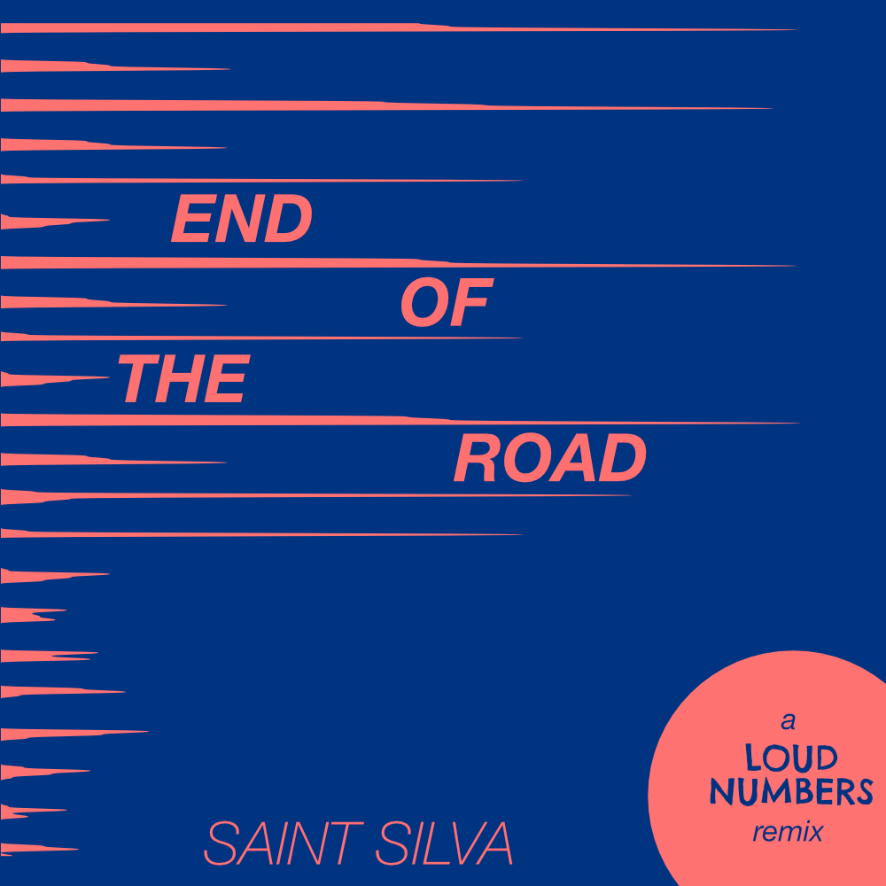

Liner notes for a new data sonification remix of the episode "End of the Road" by Loud Numbers.

<!-- start main content -->

<figcaption style="font-style: italic; margin-top: -20px">The album art for this remix contains an added layer of meaning: data is encoded in the "spikes" reaching from left to right, representing the declining trend.</figcaption>

Today I'm happy to finally release a collaboration with [Loud Numbers](https://www.loudnumbers.net/), a data sonification podcast co-hosted by my friend [Duncan Geere](https://www.duncangeere.com/). After [my first release](https://saintsilva.bandcamp.com/) as *Saint Silva* last year, Duncan approached me to see if I'd be interested in doing a remix of one of their sonification tracks. Of course, I said yes.

<aside style="float: right; font-style: italic; width: 250px; padding: 10px">
  Liner notes (also sleeve notes or album notes) are the writings found on the sleeves of LP record albums and in booklets which come inserted into the compact disc jewel case or the equivalent packaging for cassettes<a href="https://en.wikipedia.org/wiki/Liner_notes" target="_blank">(Wikipedia)</a>.
</aside>

In tandem with the remix, I wanted to release some "liner notes" to go along with it. Liner notes more and more feel like a thing of the past, unless you are still a vinyl collector. But I have always loved reading about an album as I listen to it and picking apart its processes. In this situation, because the piece of music is also a sonification of data, it feels especially appropriate. And unlike the Loud Numbers podcast, I have not included a spoken introduction to the remix, so these notes act as a kind of substitute.

## What's a data sonification?

If you're familiar with the term "data visualization" then you're halfway to understanding sonification already. In data visualization, you translate numbers (for example) into some visual form that can then be compared to one another. Spreadsheets become bar charts, scatter plots, etc. Data *sonification* uses this same process of translation, but the output is sound instead of a visual graphic. 

The best way to learn about data sonification is to take a guided tour. By "tour" I mean listen to [Loud Numbers](https://www.loudnumbers.net/), which is "guided" by co-hosts Duncan Geere and Miriam Quick. Unlike some sonifications which just start as a standalone piece of music, Duncan and Miriam introduce the dataset behind each piece from the start and then break down what each musical element in the coming song represents in the data (audio liner notes!).

Specifically, the best way to listen to my remixed version of the episode "End of the Road" is to [listen to the original first](https://anchor.fm/loudnumbers/episodes/The-End-of-the-Road-e131bnl).

## A data sonification remix (re-sonification?)

Now, the concept of a remix is likely familiar to most. But remixing a piece of data sonification introduced some interesting questions: do I remix only the sounds? Do I make samples from the source sounds and make a new song from those? These paths would lead to what we normally think of when we hear the word "remix"—a song that loosely resembles the form of the original in key, melody, hook, etc. but differs in other noticeable ways. 

But this is not an ordinary song; it also represents data captured in the real world (and a sombre dataset at that...see data notes further down). I wanted to keep the integrity and message of the data in tact, which meant that my remix would also double as a "re-sonification".

The remixed version that you hear is a musical reinterpretation of the original piece, in that I seletected different instruments, sounds, timbres, etc. to use. But it is also a different interpretation of the data, in that I wrote my own script to translate the dataset into musical notes which are used throughout the piece.

## Notes on the dataset and sonification methods

The dataset behind the sonification tells the story of a mass decline in insect life over the course of 22 years in Denmark. The origins of the dataset has a curious story; in 1997, Danish researcher Anders Pape Møller started documenting how many small and large insects hit his windshield on his weekly drives down the same two stretches of road.

### The data

 The dataset contains 1,375 observations between 1997 and 2019. In addition to the number of insects, Møller also documented the temperature, wind speed, preccipitation, and even the car model for each record. You can view all data used in the study [here](https://datadryad.org/stash/dataset/doi:10.5061/dryad.gq73493).

Over the course of 22 years, Møller found a **10x decrease in insects in this region**. In 2019, he published his findings in a [research article](https://onlinelibrary.wiley.com/doi/10.1002/ece3.5236) in peer-reviewed journal. 

Climate change comes to mind as the obvious culprit of the insect decline. But even when using computer models and statistical methods to control for the anticipated effects of climate change, the number of insects still falls by half, suggesting that human factors such as pesticides are making the situation much worse.

You may not think much about insects, but they are essential to ecosystems. And this dataset essentially tells the story of a mass murder.

### The sonification

To smooth out some of the signal in the data, I summed up the total insect count by month (as did the Loud Numbers original). My default method of sonification for this piece is called *parameter mapping*, which essentially involves translating numbers into notes in a predefined key. 

To form the base of the piece, a series of descending synth chords documents the percentage decline of the insects over time. A [recent meta-analysis](https://www.science.org/doi/10.1126/science.abf1915) has found that each year, the number of terrestrial insects is going down by about 1.11%. In the song, the notes decline less frequently than each year, but instead spread out over a single octave across the entire song.

<audio controls>
  <source src="../assets/audio/loud_numbers/pad.wav" type="audio/wav">
Your browser does not support the audio element.
</audio>
 
Synth pad clip representing decline in abundance.

Whenever the percentage decline of insect abundance goes down 5% from the baseline (i.e. starting point in 1997), you will hear a resounding crash symbal like the one below.

<audio controls>
  <source src="../assets/audio/loud_numbers/crash.wav" type="audio/wav">
Your browser does not support the audio element.
</audio>
 
Crash symbal sound every 5% decrease.

In addition to the intermittent crash, a kick drum and rim-shot will sound once every 10 months. This doesn't capture any data directly other than the passing of time, but it helps move the song along. I felt that the delay on the rim-shot provides a sort of ominous soundtrack vibe.

The key data point (number of insects) is captured by this weird synth patch I discovered called "Disintegration". This patch continues throughout the song and arpeggiates along an octave with some delay. At a basic level, higher notes represent higher numbers, which can be heard in the sample below. The final tones I landed on in this patch made me think of fluttering, struggling creatures in the sky.

<audio controls>
  <source src="../assets/audio/loud_numbers/bugs-start.wav" type="audio/wav">
Your browser does not support the audio element.
</audio>
 
Synth lead representing number of insects.

But across the entire song, I also mapped the trends of decline to additional parameters. Torwards the end of the song, the synth starts to "break up" a bit and sound more wobbly and broken, representing the frailty of ecosystems that can depend on even the tinest of creatures. This type of parameter mapping, while a bit harder to distinguish than "higher notes, higher numbers" brings more personality and emotion to the process of sonification. When the synth sounds like this, the total number of insects per month is either just above or at zero most of the time.

<audio controls>
  <source src="../assets/audio/loud_numbers/bugs-end.wav" type="audio/wav">
Your browser does not support the audio element.
</audio>
 
Disintegrating synth lead representing collapse of ecosystem.

Finally, a booming bass line drives through the song on every quarter note. The notes played by this bass are mapped to the average recorded temperature for each month of the study. Again, I used the same mapping scale as the insect abundance: higher notes = higher numbers. The bass line is a good way to keep track of the changing seasons: ascending notes typically represent the transition into spring and summer. As the song progresses, you the bass line sounds more and more prominent. It's not that the bass is getting louder; it's the absence of those piercing high notes from the synth lead.

<audio controls>
  <source src="../assets/audio/loud_numbers/bass.wav" type="audio/wav">
Your browser does not support the audio element.
</audio>
 
Disintegrating synth lead representing collapse of ecosystem.

Underneath the entire track I weaved in a field recording of cars driving down a road near my house to stay true to the feeling of the original track.

## Technical notes

A brief overview on how I created the sonification piece.

- data processed using Python in a Google Colab notebook
- translated data into musical notes using `miditime` library and with help from the [this Reveal News tutorial](https://revealnews.org/blog/turn-your-data-into-sound-using-our-new-miditime-library/)
- instruments created and parameters automated in Ableton Live
- mixed and mastered in Ableton Live