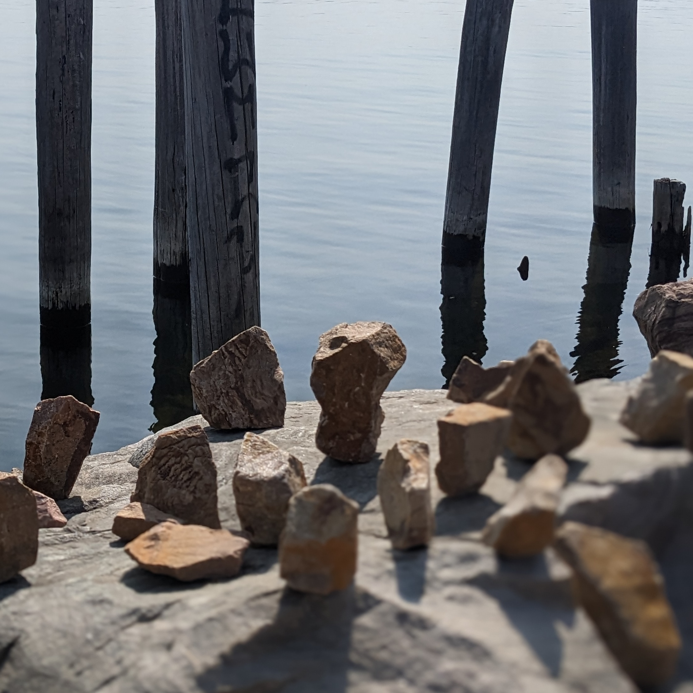

<figcaption style="font-style: italic; margin-top: -20px">"Cascades" was composed for the Antihistamine 2023 (HT098) compilation, out now on Bandcamp.</figcaption>

---

I'm excited to announce a new song release today, [*Cascades*](https://saintsilva.bandcamp.com/track/cascades), courtesy of Histamine Tapes. The [entire compilation](https://histaminetapes.bandcamp.com/album/antihistamine-2023-ht098) is pay what you want, and any money made from the compilation will be used to cover HT's operating costs for the next year, and go into a pool to donate to local charities. You can find my piece, Cascades, [here](https://saintsilva.bandcamp.com/track/cascades).

Each year Histamine Tapes, an experimental tape label our of Montepelier VT, does a compilation release under a different theme. This year's prompt was "rocks". The rules were simple: 
1. the song must use rock sounds 
2. the song cannot include synthesizers

I haven't released much music lately as I have focused on honing the live performance aspect of Saint Silva.  Many Saint Silva tracks are improvised, and I hardly ever play with the same rig twice. As a result I haven't spent much time recording. But I loved the idea of these strict creative boundaries as a generative process towards a finished piece. Below are notes on how I collected and manipulated rock sounds to create this experimental track.

## Recording notes

All sounds used in this song are, literally, rocks. I didn't use any other sounds from my field recordings—it had to include a rock hitting something. No instruments were used. I used a Zoom H4 field recorder to record different rock sounds: dropping rocks on other rocks, dropping rocks in water, scraping rocks together. I found this small quarry type place on the Winooski river and started throwing rocks at the side of a large rock face. This created a cool delay like effect as the rock cascaded down the side of the rock face wall. 

These field recordings became my source material. After isolating some of the best sounds, I brought in these samples to Ableton and started some manipulation. Samples that retained some tonal quality (the rocks interacting with water proved to be best for this) became pitched samples to use for melody sequences. 

I had many options to choose from when it came to percussive style rock clicks. Rather than use only a few samples, I sliced the field recordings by transient and then used a random sequencer to arpeggiate through the sounds. This created a nice glitch like effect with lots of pops and clicks. Some of the larger rocks ended up becoming pitched down kicks and the tonal bass line.

To give the track a bit of atmosphere, I pitched up the arpeggiated melody and then ran it through some stacked reverbs and delays. This allowed me to create a pad-like instrument behind the percussive parts which carry through the various sections of the piece.

I'm really happy with how the final track came out. Creatively, this was a refreshing excercise to help break out of a recording rut. Somehow, the paradox of giving myself rules to follow while making this song made me feel even more freedom to experiment. I'd like to thank Nick Dentico for putting together the comp this year and for the opportunity to publish with so many other (40+) talented sound artists.

Listen to the whole comp here: https://histaminetapes.bandcamp.com/album/antihistamine-2023-ht098