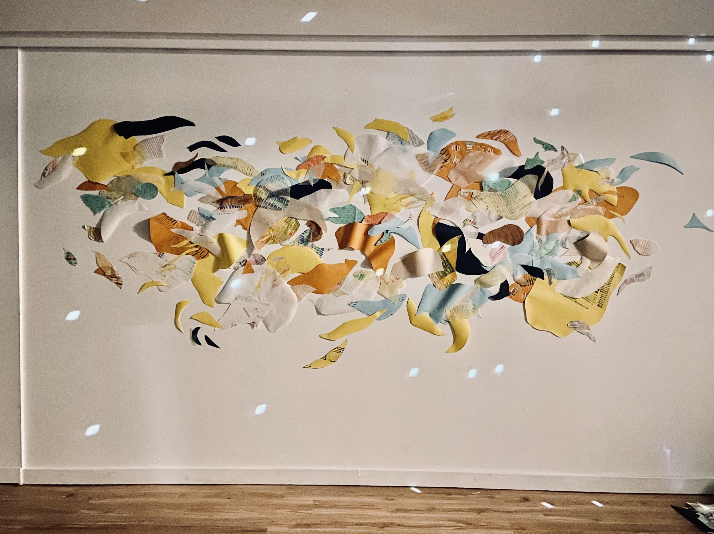

On July 12-13, I had the opportunity to debut my first sound installation work as St. Silva. 

*Paralleling* was a community based art experience and installation at [The Phoenix Gallery](https://thephoenixvt.com/), guided by visual artist, by artist [Linden Eller](https://www.lindeneller.com/). It included multiple stations with different materials where participants can experience the reflective, meditative, and playful nature of mark making. As participants made series of hatch marks, Linden used these materials to assemble an intuitive, abstract installation in the gallery. 

I was approached by Phoenix curator Joseph Pensak with the idea of providing some soundscapes for the event. After talking with Linden, I was immediately drawn to the evolving, unpredictable nature of the collage taking shape over two days. So I proposed that the music do the same.

<figcaption style="font-style: italic; margin-top: -20px">Photo of people sitting at various stations making marks, which became the material for the wall mural.</figcaption>

The result was *Chromallel*, an interactive sound installation that watched and responded to the creation process taking place on the wall. The installation used a webcam facing the mural wall. The system would then constantly "watch" for certain colors on the wall. When a color was found, it was added to a list of color totals. This data was then converted to musical parameters and sent from a laptop to some hardware synthesizers. 

The inception of this idea was largely inspired by generative music at large, pioneered by artists like Brian Eno and Steve Reich. The "musical parameters" that I set can also be thought of as a sort of guideline or boundary: before the event, I set the key of the soundscape, a series of possible notes and sequences, a series of possible sound sources and synthesizer tones. I think of this process as dropping a leaf in a river upstream; as the leaf floats, the river branches off into smaller and smaller tributaries. But these tributaries don't stay separate forever—they can rejoin and combine further downstream.

INSERT DIAGRAM OF TRIBUTARY ANALOGY

*Chromallel* worked the same way. When the exhibit first started, the soundscape was very sparse since there wasn't much on the wall yet. The first day, Linden happened to use more blues and greens on the wall. This nudged the system into a more somber tone, using minor chords and modes for the melodies. By day 2, more yellows and oranges were on the wall, and this became the more dominant color scheme, which took the soundscape into a different sonic direction. 

A few things were surprising about the soundscape, but all in a delightful way. For example, the light—it changed throughout the day, during periods of cloudiness or as the afternoon faded into dusk. As a result, the way that the camera "saw" the colors changed. Perhaps there was more dark blue shades, whereas a few minutes before, the camera picked up on lighter shades of blue.

Another surprise was the happy accidents that happened when the camera picked up on non-mural things. When Linden walked into the frame, *Chromallel* latched on to the color of her dress and amped up the dark hues in its system. When she left the frame, after adding new colors to the wall, the system reset to the colors on the wall. I probably could have added some code to correct for this, but instead was delighted by the "artist in frame" having a noticeable (albeit temporary) effect on the soundscape. 

Throughout the event, I took snippets of recordings from the mixer to capture interesting moments of transition in the soundscape. After the first day I listened back to some material, and I realized that it didn't sound quite complete without the sounds in the room—the scratching of pencils, the rustling of paper, the tearing of tape. These sounds were as much a part of the musical performance as the notes coming from my synthesizers. So on day two, I recorded bits of mark making, Linden cutting paper and tacking it to the wall, birds outside the gallery. 

## Reflections

- was surprised how much the foley sounds (pencils scratching, markers being dropped in glass jars, scissors cutting paper) felt inherently part of the soundscape, inseperable almost
- when Linden entered the frame of the camera, the system would treat her as part of the piece. From one perspective, this is an error, and the system shouldn't be latching onto the color of her dress. But while it happened, I decided not to intervene and correct the code here: the artist being "in frame" is also inherently part of the exhibit. The visual of the artist standing in front of the wall, adding colors and shapes, is part of the experience. Sometimes if Linden was standing there long enough, the musical character of the soundscape would shift slightly, before eventually returning to a more "stable" state using only the colors and shapes on the mural wall.
