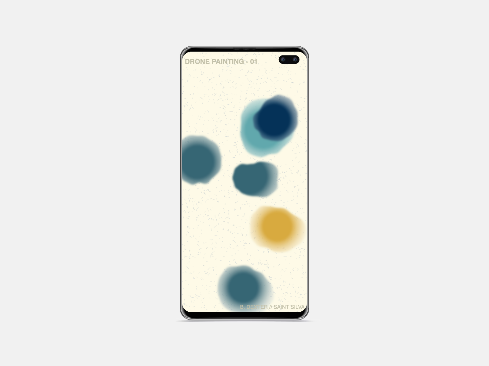
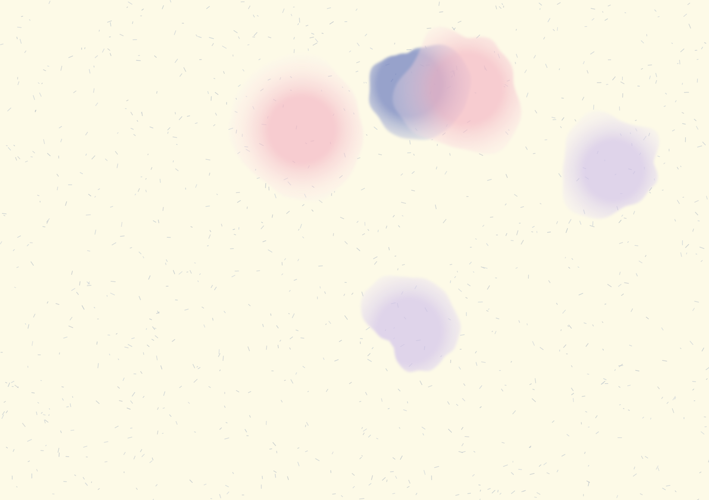
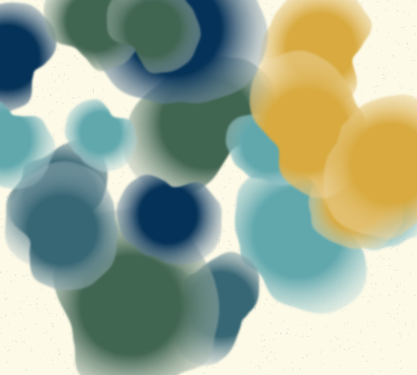

Exploring the potential for generative, browser-based soundscapes with audiovisual output

<!-- start main content -->

.png)

### Drone Paintings is a new series of generative audiovisual pieces. The [first edition](https://drone-paintings.netlify.app/) launched today. You can read more about why and how I made it in the article below. Visit [drone-paintings.netlify.app](https://drone-paintings.netlify.app/) to listen to the piece.

For the past year, I've become fascinated with the concept of music as a process. An idea that is often loosely credited to ambient pioneer Brian Eno, this approach flips the script of the usual music-making process: instead of starting with a melody or hook in your head, and then playing instruments to "bring it to life", you instead start with a blank slate. The blank slate is a canvas upon which music can be expressed, and this expression is achieved through a set of rules.

When these rules are applied consistently, they can lead to unexpected results. Of course, now I'm talking about [systems music](https://en.wikipedia.org/wiki/Systems_music). 

## A systems music approach

Instead of writing a song, the composer instead builds a "system" of music. Inside of this system are rules, algorithms, triggers, and more that "decide" which notes to play and at what time. As someone who writes code for my primary job, this concept immediately clicked with me. An absurd amount of software is made up of conditional statmenets (ex. if *x* is happening, then do *y*).

Software seems uniquely suited to this type of musical composition.

This approach also introduces an interesting distinction in the composition process, specifically between what we think of as human-computer interaction. The task of composing is delegated by the human to the computer. With the task of writing and playing notes offloaded, the human takes on the sole role of the *editor* or *curator* of the piece. This might seem like splitting hairs, but for me it feels liberating.

In my own musical practice, I find the editing/mixing of my own music (which I played/recorded) to be an excruciating process. I am too previous about what I have created. But when I surrender the composition to an "unbiased" system (in reality there is no such thing, but for the sake of argument) on my laptop, I can instead focus on what works and what doesn't work. 

To illustrate, here's an exmample: In a [podcast interview](https://www.youtube.com/watch?v=BOtrCYyf4cg) with Rick Rubin, Brian Eno describes how he uses this process in his own compositions. For some projects, Eno will collaborate with a software developer to build generative scripts that can run inside of a DAW. After selecting some basic instrument plug-ins, Eno will let the script run for hours at a time over his studio speakers, going about the tasks of his day. When he hears a section that he particularly liked, or that was unexpected, he writes down the minute and second mark in a notebook. Then, after a day of basking in ambient tones, he splices up the sections corresponding to the notations in his notebook to use in future pieces.

The tactic of composer-turned-curator invites the opportunity for the unexpected. The human has creative input through the set of "rules", which is a creative act itself, but past that it runs free. I wanted to create systems in this spirit.

## Music in the browser

Drone Paintings run in the browser. Browser-based art is not a new medium for me, but it is when it comes to audio. A few years ago I dipped my toes into the world of [p5.js](https://p5js.org/) in order to learn some geneartive art techniques. The experience was an eye-opening exposure to theories of randomness and algorithmic art. But most of all, it showed me how much could be done directly in the browser.

<figcaption style="font-style: italic; margin-top: -10px">Drone Paintings are responsive and run just as well on mobile devices.</figcaption>

In 2021, I started to publish some of my music again. I have been a musician for most of my life, but for years after I graduated college it sort of fell by the wayside. After [a few releases](https://bdexter.bandcamp.com/music) and an [experimental ambient album](https://saintsilva.bandcamp.com/releases), I felt the rust starting to wear off. I remembered the old processes and tediums of producing my own music. For simplicity I use Bandcamp (also because they are an honest company), but I often found people saying "why isn't your stuff on Spotify?"

Spotify has the benefit of being almost universally accessible in some way, but I don't know if my music is always the best fit for it. You know what is even more accessible than Spotify though? 

**The browser**. 

If you have access to the internet, you have access to a browser. If I could host my music directly in the browser, anyone could listen regardless of platform. And even better, content accessed via the browser has the unique capacity to *change*. 

If I released a track on Spotify, and then decided "oh, you know, I don't like that guitar part anymore", I would have to:

1. edit the track in Ableton
2. export to laptop
3. re-upload to Tunecore, CD Baby, whatever
4. wait for it to push the new version (can be up to 48 hours...

In contrast, music in the browser can be changed almost instantly. And even better, code-based music has the ability to change each time the page is loaded; randomly generated patterns of notes mean that the piece has the potential to be a one-of-a-kind experience. The sequence of notes you hear will not be the sequence someone else hears.

The nature of software "releases" also presents an interesting opportunity when it comes to music. Software is often relased in stages (Alpha, Beta, etc) and frequently includes "patch" updates which have minor fixes and improvements for a website. What if music could be more like that? What if each song had a commit history, similar to what you find on Github, which shows how it has grown and evolved over time? The closest thing I can think of in traditional music publishing are remixes and reissues. Both have there purposes, but neither are as immediate or *iterative* as the software publishing process.

Music published through the browser also contains an interesting technical distinction that approaches the realm of conceptual and experiential art. Rather than a static file (song) being hosted on a single server, browser-genearted music instead is distributed to listeners *each time the webpage is called*. This reminds me of Sol Lewiitt's [*Wall Drawings*](https://whitney.org/education/families/kids-art-challenge/sol-lewitt) series—instead of painting the drawings himself, the artist dispatches a series of instructions to a gallery, and participants create the painting themselves. The concept, rather than the implementation, is the art. In the case of Drone Paintings, the "instructions" are blocks of code.

<aside style="float: right; font-style: italic; width: 250px; padding: 10px">
  For an in-depth review and walkthrough of systems music in the browser, see Tero Parviainen's excellent <a href="https://teropa.info/blog/2016/07/28/javascript-systems-music.html" target="_blank">Javascript Systems Music</a>.
</aside>

Finally, I feel that the browser has a natural capacity for a passive listening experience. I have [previously written](notepad/saint-silva-music) about this concept for my work as *Saint Silva*, but in short, there is a genre of music that is meant to be felt but not listened to. Erik Satie first called this ["furniture music"](https://en.wikipedia.org/wiki/Furniture_music); something you have on in the background, but don't pay much attention to. It creates a vibe, an ambience. 

How many times have you opened a new tab in your browser and left it open for days? This website is that. You can start the program, and it will play a series of synth swells endlessly to create a background vibe.

## Painting music

Because this piece of music is generated via code in the browser, I began to think of more ways to express the notes being generated. Under the hood, the code is outputting numbers which are mapped to sounds. My current profession consists of mapping numbers to visuals to create charts and graphics, so the visual medium seemed like an obvious opportunity.

Along with the drones, a random series of watercolor marks appear on the page. I wanted to simulate the feeling of dripping paint at random, creating layers of abstract colors that blend together. As the program continues to run, the canvas is filled with more and more wet blobs. And to make the experience feel more personal, at any time, you can press "S" and save your painting to the desktop.

Aside from being visually calming, I wanted to explore this concept of expressing a single output for a variety of senses. What do songs look like? How do paintings sound? These quesitons are uniquely suited for an interdisciplinary approach, and technology makes it even more possible to investigate them.

## Technical notes

Drone Painting - 01 was built with [Tone.js](https://tonejs.github.io/) and [p5.js](https://p5js.org/). I decided to go framework-less for this first edition to keep things simple. The synthesizer sounds are being generated from three signals: two sine waves, and a drone. Each signal is fed through an effect processor which includes reverb and delay.

I have plans to do future releases in this series (hence the 01 tag) and maybe some improvents (re: patches!) to the first edition. Creating music with code allows me to do both of these things seamlessly. Feeling hopefuly about exploring this new medium. More to come.