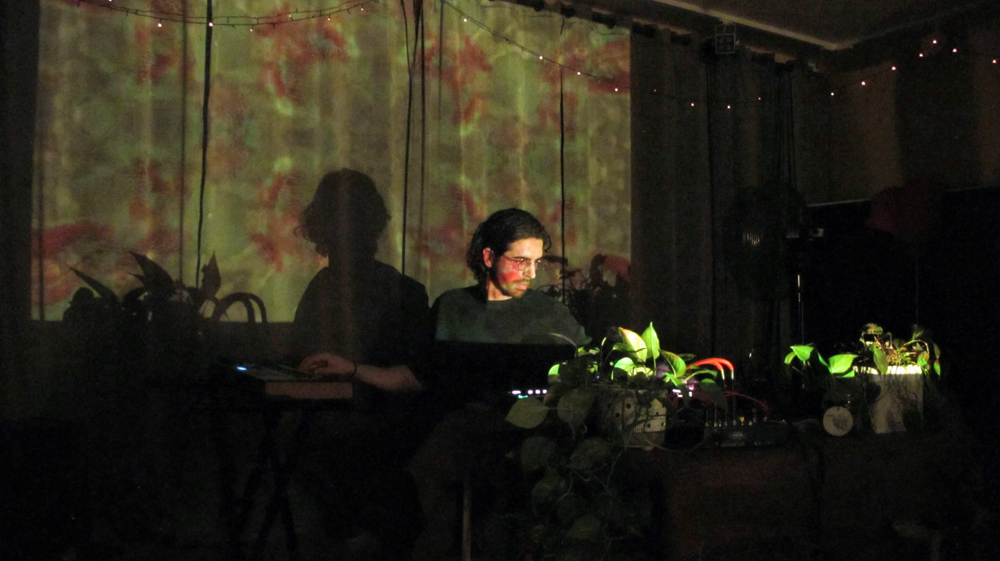
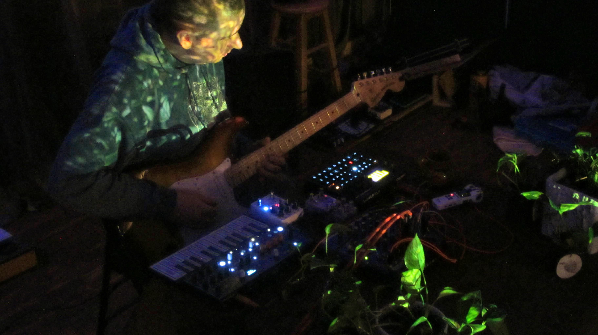
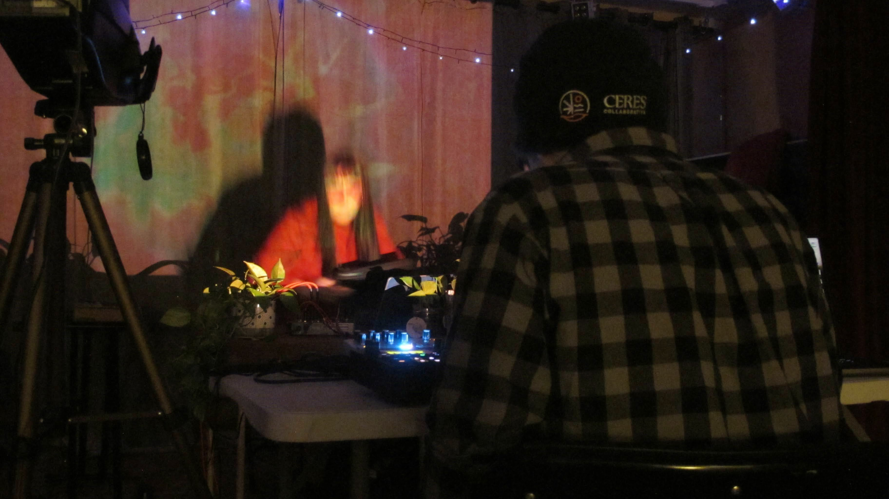
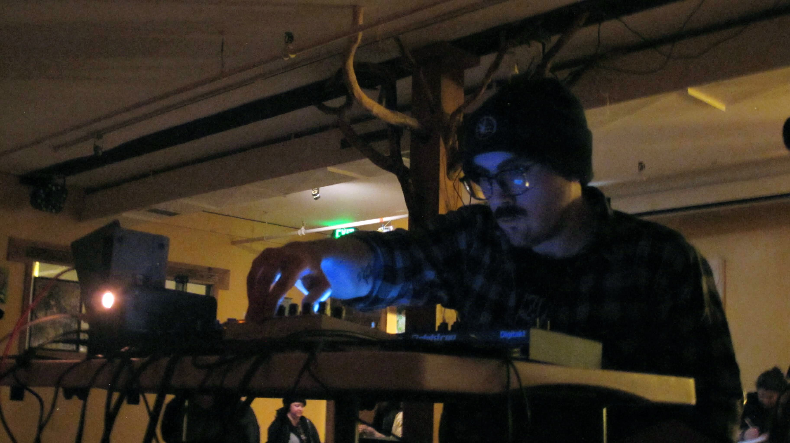
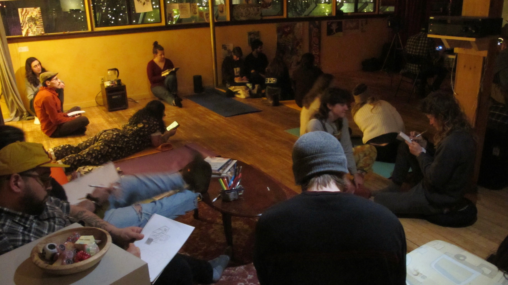
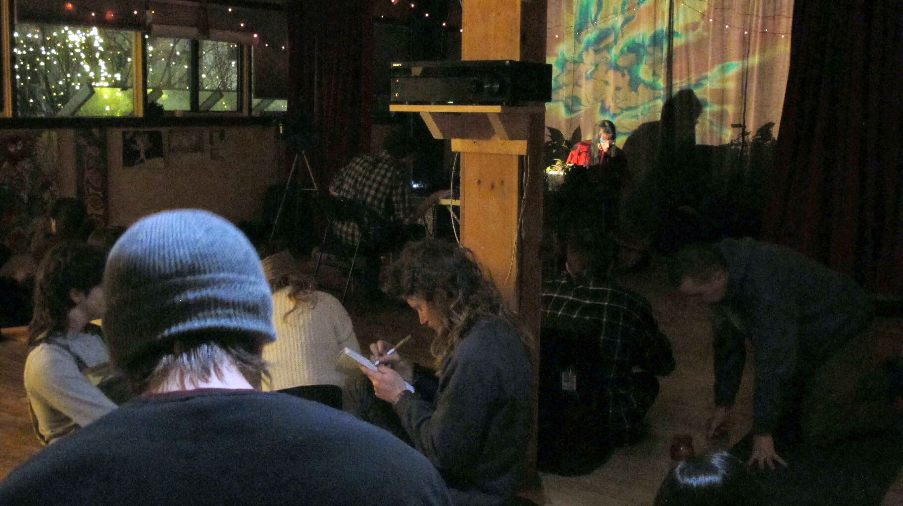
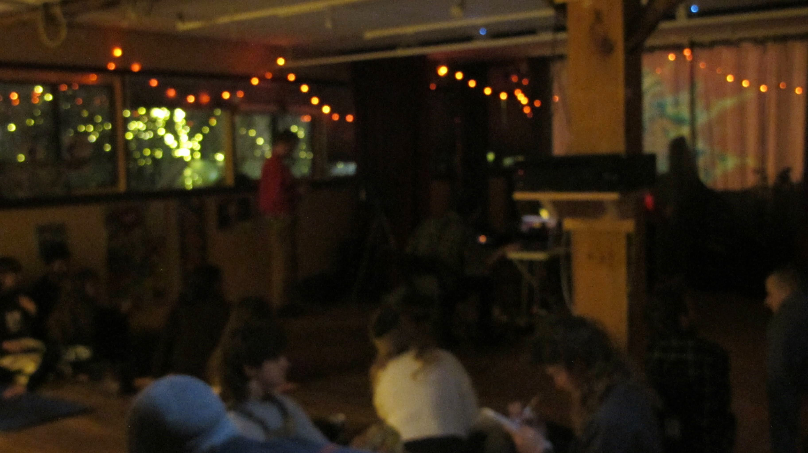

Ethereal Bloom is a series highlighting ambient and experimental music at Spiral House Collective. This is an idea I have wanted to pursue for a long time, and I'm excited to get it off the ground. 

My hope is that Ethereral Bloom can be a different kind of venue and series: a true listening experience, which welcomes both the attuned musician and the passive listener just wanting to chill out.

The shows feel like a cozy living room and include much more than just music. Ethereal Bloom features live projected visuals behind the musicians performing. 

Movement at Ethereal Bloom is welcome, and so is lying on the floor. Drawing materials, poetry books, and hand fidgets will be provided. This is a space that welcomes folks who may feel overstimulated at typical gigs! Below are a few photos from the first Ethereal Bloom.

The [next bloom](https://www.instagram.com/p/C5B46f5OhBs/) will be April 5. 

4

