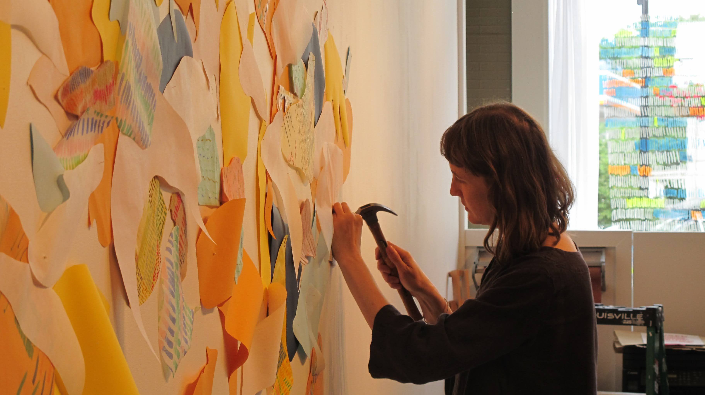

On July 12-13, I had the opportunity to debut my first sound installation work as St. Silva. 

*Paralleling* was a community based art experience and installation at [The Phoenix Gallery](https://thephoenixvt.com/), guided by visual artist [Linden Eller](https://www.lindeneller.com/). It included multiple stations with different materials where participants can experience the reflective, meditative, and playful nature of mark making. As participants made series of hatch marks, Linden used these materials to assemble an intuitive, abstract installation in the gallery. 

<figcaption style="font-style: italic; margin-top: -20px">Two friends making marks together at a table. These pages were then cut up and collaged on the wall.</figcaption>

I was approached by Phoenix curator Joseph Pensak with the idea of providing some soundscapes for the event. After talking with Linden, I was immediately drawn to the evolving, unpredictable nature of the collage taking shape over two days. What colors would she use? How would participants draw their marks? The possibilities felt alive, unknowable. So I proposed that the music do the same.

The result was [*Chromallel*](https://stsilva.bandcamp.com/album/paralleling-installation-audio-collage), an interactive sound installation that watched and responded to the creation process taking place on the wall. The installation used a webcam facing the mural wall. The system would then constantly "watch" for certain colors on the wall. When a color was found, a piece of custom software calculated a list of color totals. This data was then converted to musical parameters and sent from a laptop to some hardware synthesizers, a sort of data sonificaiton, but the data was generated based on computer vision.

<figcaption style="font-style: italic; margin-top: -20px">Chromallel at work—the screen displays a bar graph of total approximate colors picked up from the webcam image.</figcaption>

The inception of this idea was largely inspired by generative music at large, pioneered by artists like Brian Eno and Steve Reich. The "musical parameters" that I set can also be thought of as a sort of guideline or boundary: before the event, I set the key of the soundscape, a series of possible notes and sequences, a series of possible sound sources and synthesizer tones. I think of this process as dropping a leaf in a river upstream; as the leaf floats, the river branches off into smaller and smaller tributaries. But these tributaries don't stay separate forever—they can rejoin and combine further downstream.

<figcaption style="font-style: italic; margin-top: -20px">Generative music allows you to set the charater of each stream, but you don't know which waterway will be taken for each musical measure.</figcaption>

*Chromallel* worked the same way. When the exhibit first started, the soundscape was very sparse since there wasn't much on the wall yet. The first day, Linden happened to use more blues and greens on the wall. This nudged the system into a more somber tone, using minor chords and modes for the melodies. By day 2, more yellows and oranges were on the wall, and this became the more dominant color scheme, which took the soundscape into a different sonic direction. 

At the end of day 2, I concluded the installation with a short performance alongisde *Chromallel*. Even though I created the boundaries of this system, I didn't know exactly how it would sound until the mural was finished, creating a form of improvised duet with a machine.

<figcaption style="font-style: italic; margin-top: -20px">Every 30 seconds, Chromallel took a screenshot of the webcam frame. This GIF shows how the mural evolved over two days (sorry for poor image quality).</figcaption>

A few things were surprising about the soundscape, but all in a delightful way. For example, the light—it changed throughout the day, during periods of cloudiness or as the afternoon faded into dusk. As a result, the way that the camera "saw" the colors changed. Perhaps there was more dark blue shades, whereas a few minutes before, the camera picked up on lighter shades of blue.

<figcaption style="font-style: italic; margin-top: -20px">An example of the Chromallel interface: red dots on screen represent clusters of color that the system recently added to its memory.</figcaption>

Another surprise were the happy accidents that happened when the camera picked up on non-mural things. When Linden walked into the frame, *Chromallel* latched on to the color of her dress and amped up the dark hues in its system. When she left the frame, after adding new colors to the wall, the system reset to the colors on the wall. 

 <video width="350" height="auto" controls>
  <source src="../assets/paralleling/20240712_195818.mp4" type="video/mp4">
  Your browser does not support the video tag.
</video> 

I probably could have added some code to correct for this, but instead was delighted by the "artist in frame" having a noticeable (albeit temporary) effect on the soundscape. The visual of the artist standing in front of the wall, adding colors and shapes, is part of the experience. 

<figcaption style="font-style: italic; margin-top: -20px">Linden Eller tacking in paper for the mural. Each piece was taken from a sheet of paper full of hatch lines, vertical marks, and other kinds of repetitive mark marking.</figcaption>

Throughout the event, I took snippets of recordings from the mixer to capture interesting moments of transition in the soundscape. After the first day I listened back to some material, and I realized that it didn't sound quite complete without the sounds in the room—the scratching of pencils, the rustling of paper, the tearing of tape. These sounds were as much a part of the musical performance as the notes coming from my synthesizers. So on day two, I recorded bits of mark making, Linden cutting paper and tacking it to the wall, birds outside the gallery. 

<figcaption style="font-style: italic; margin-top: -20px">Chalk guiding people into the gallery.</figcaption>

<figcaption style="font-style: italic; margin-top: -20px">Photo of people sitting at various stations making marks, which became the material for the wall mural.</figcaption>

From theses recordings, I created two ["audio collages"](https://stsilva.bandcamp.com/album/paralleling-installation-audio-collage) which feature music from *Chromallel* alongside interwoven sounds of the scratching, tearing, and rustling of the room. Some dawn and dusk birdsong even finds its way in. This approach to mixing was new to me, but felt appropriate for a few reasons: the mural itself was a collage, so I was drawn to the symmetry of an audio track being a kindred spirit. 

Even though many of the samples and sounds were created beforehand, the exhibit itself created new sounds by nature of people being there, drawing on paper, picking up pencils. And finally, I wanted to try to distill the feeling of being in the room into a condensed experience—these sounds took place over the course of 5-6 hour days, but it was so hard to choose which noises or which takes off the mixer to keep. So instead I blended them into something similar, but new. You can listen to these collages [on Bandcamp](https://stsilva.bandcamp.com/album/paralleling-installation-audio-collage).

<figcaption style="font-style: italic; margin-top: -20px">You can listen to <a href="https://stsilva.bandcamp.com/album/paralleling-installation-audio-collage">"Paralleling" on Bandcamp</a>.</figcaption>

## More scenes from the exhibit

<figcaption style="font-style: italic; margin-top: -20px"></figcaption>

<figcaption style="font-style: italic; margin-top: -20px"></figcaption>

<figcaption style="font-style: italic; margin-top: -20px"></figcaption>

<figcaption style="font-style: italic; margin-top: -20px"></figcaption>

<figcaption style="font-style: italic; margin-top: -20px"></figcaption>

<figcaption style="font-style: italic; margin-top: -20px"></figcaption>

<figcaption style="font-style: italic; margin-top: -20px"></figcaption>

