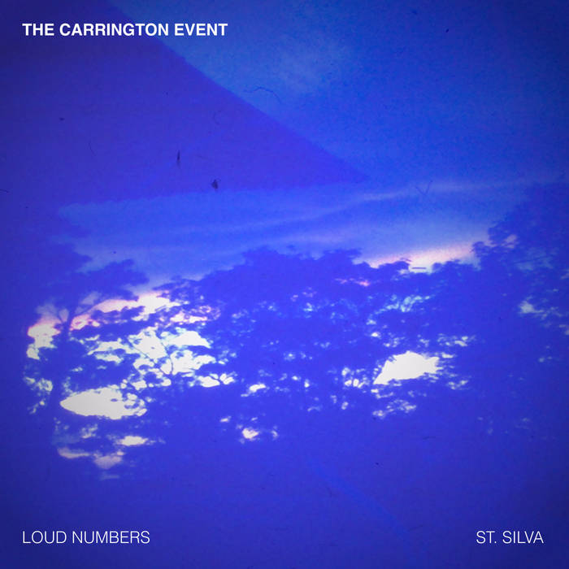

Today I'm happy to release a new split single with my friend Duncan Geere: [*The Carrington Event*](https://camembertelectrique.bandcamp.com/album/the-carrington-event), out now via French label [Camembert Électrique](https://camembertelectrique.bandcamp.com/music).

These two songs represent two different interpretations (one by me, one by Duncan) of the greatest solar storm in recorded history. We used a process called data sonification to convert the data into musical parameters. I won't go into the full details here, because Duncan and I did a full write-up about our process on the [Loud Numbers website](https://www.loudnumbers.net/carringtonevent). 

After collaborating on this piece for nearly a year, across time zones (Duncan lives in Sweden), I'm thrilled to see this come out into the world. We each did live performances of the piece in our respective home towns, and now this recording marks the final culmination of the project. Hope you enjoy.