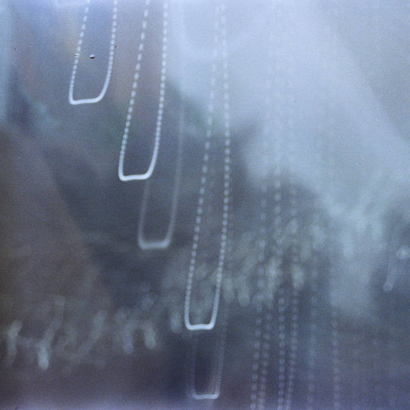
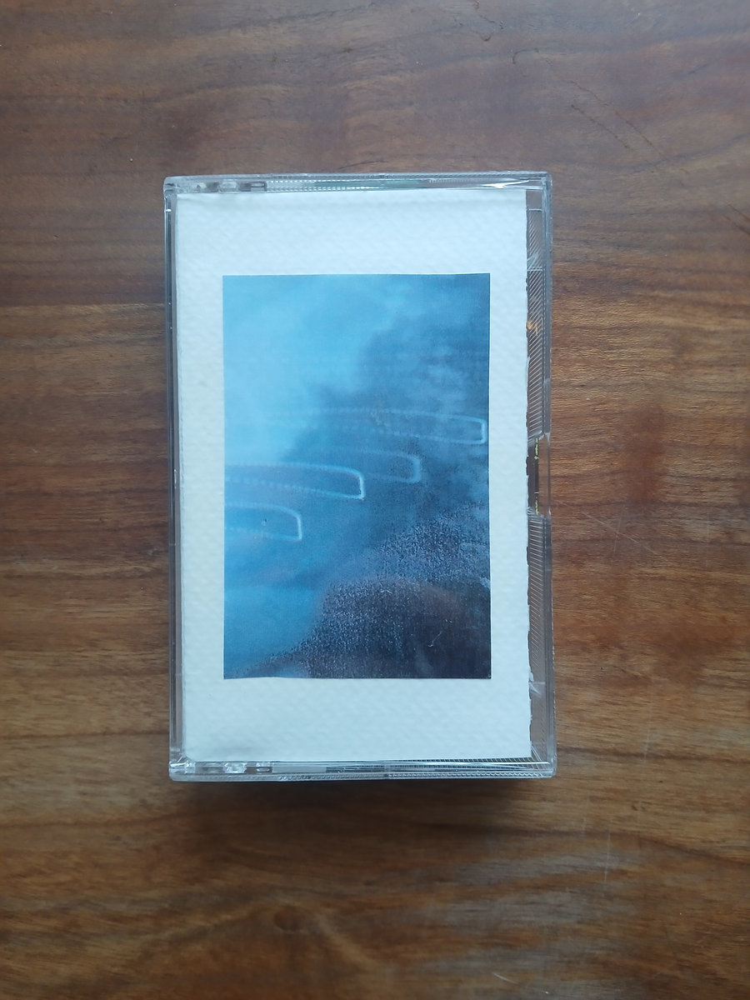
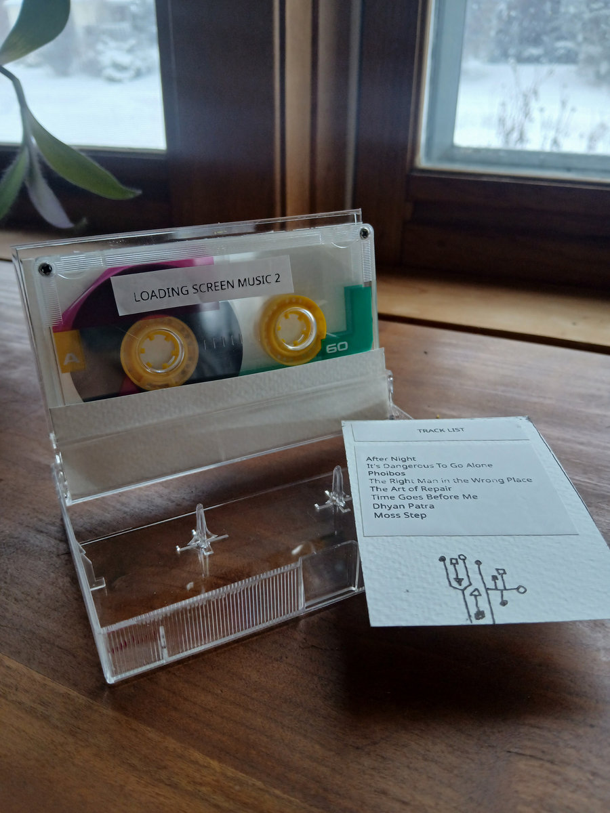

<figcaption style="font-style: italic; margin-top: -20px; text-align: center">Loading Screen Music 2 can be heard on <a href="https://stsilva.bandcamp.com/album/loading-screen-music-2">Bandcamp</a>.</figcaption>

Following the release of [Loading Screen Music](https://stsilvamusic.com/2024-06-24-loading-screen-music/), I'm happy to release the sequel in the form of "Loading Screen Music 2" with Coppermind (Ian Steinberg). These songs are for the in between times, the holding zone between starting and truly beginning.

Originally inspired by video game soundtracks and loading screens, "Loading Screen Music 2" expands the sonic palette of the first album to include more acoustic instruments and textures. The result is a warm and contemplative fabric weaved by two friends following their instincts, listening to one another, and embracing the unexpected, trading perfection for happy accidents and rough edges.

All tracks composed, performed and recorded live in a single day at Big Lake Recording Co. directly to reel-to-reel tape.

Limited run of tapes also available [for purchase](https://stsilva.bandcamp.com/album/loading-screen-music-2).

