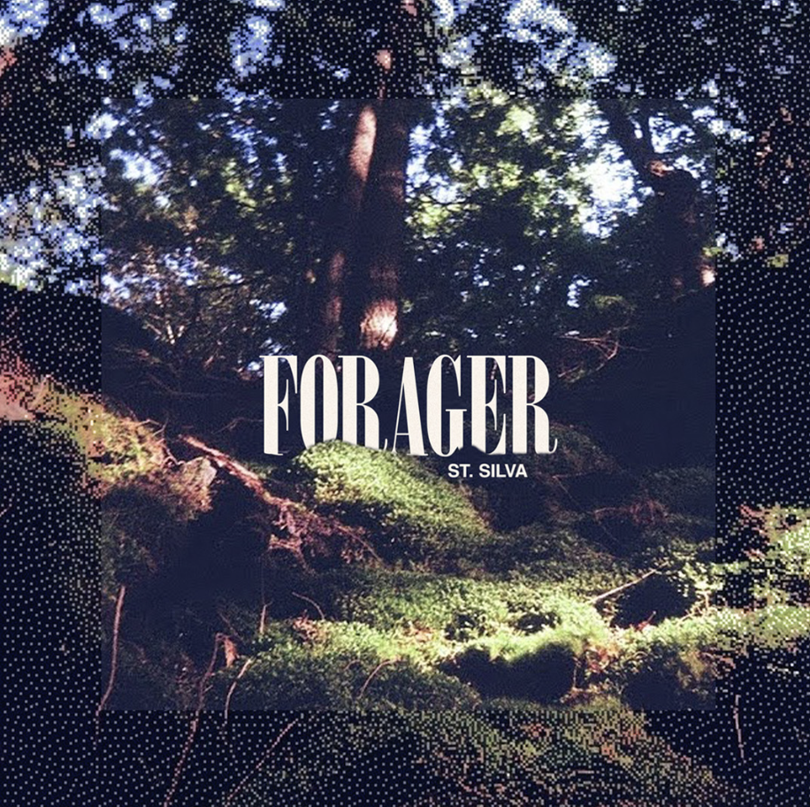
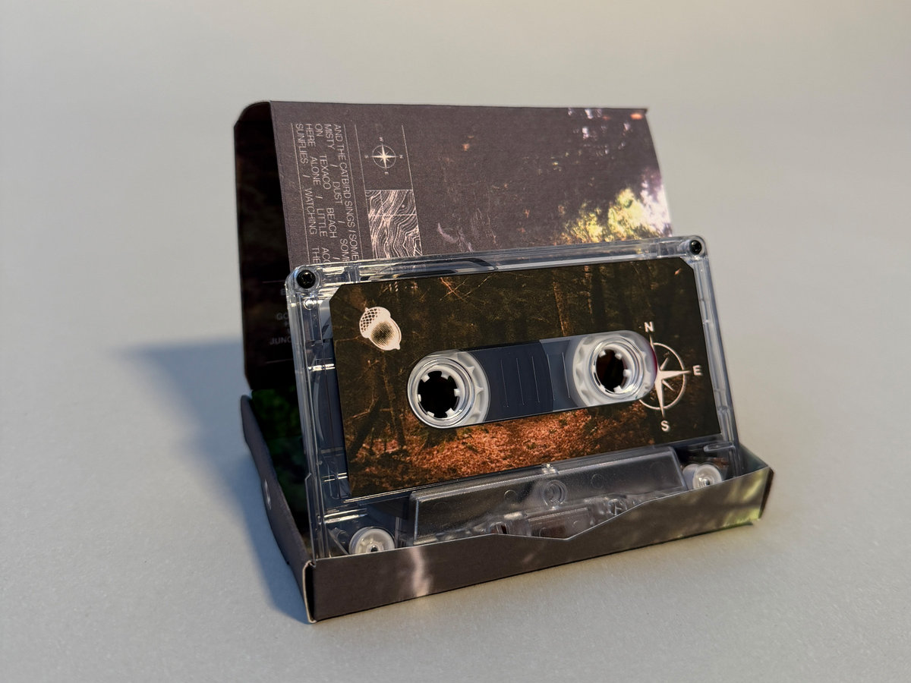
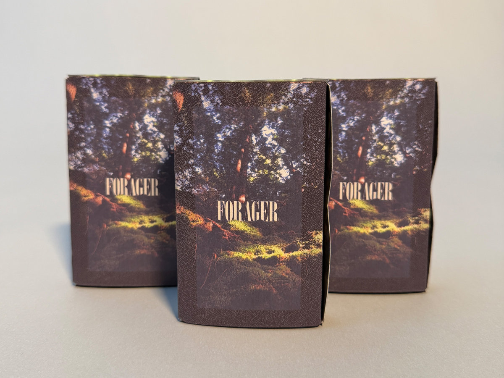

<figcaption style="font-style: italic; margin-top: -20px; text-align: center">Forager can be heard on <a href="https://stsilva.bandcamp.com/album/forager">Bandcamp</a>.</figcaption>

Announcing Forager from St. Silva, a warm collection of looping mediations that blur the line between electronic and the natural, merging formless exploration with found sounds in an unlikely collaboration of time and space.

Crafted during a year-long process of documenting, sorting, and re-collaging sonic material, Forager is a composite of material recorded months prior to their recontextualization. “Time creates distance, sometimes a healthy distance, between the art and the artist,” shares St. Silva. “This is a document, a marker of where I was during a moment of time and the sounds that inspired me.”

<figcaption style="font-style: italic; margin-top: -20px; text-align: center">Buy a cassette on <a href="https://stsilva.bandcamp.com/album/forager">Bandcamp</a>.</figcaption>

To forage is to search for, gather, or collect food or resources from the natural environment. “Sometimes playing music feels like that, more an act of discovering something than creating something.” By employing time to relinquish the source material from its time and place, St. Silva finds new context for the collected moments, and in the process discovers a whole new environment. Using a combination of tape loops, modular synthesis, field recording, and melodic synth lines, St. Silva offers a sun-drenched nostalgia where faded memories waft over analog-saturated synthetic forests.
credits
released July 17, 2026

All songs composed, recorded, and mixed by Ben Dexter Cooley.
Mastering and engineering help from Jake Wright.
Cover artwork and cassette designed by Nate Hicks.

Thank you to Maggie for the endless support and for walking with me through the woods. And a special thanks to the musical friends who gave me advice along the way while bringing this album into being: Ian Steinberg, Jake Wright, Oskar Schroeder, and Nate Hicks.

Field recordings for this album were taken in Northern Vermont, the ancestral home of the Western Abenaki people, the original caretakers of these forests. Bird song include the following collaborators: Black-capped chickadee, American Robin, Tufted Titmouse, American Goldfinch, Song Sparrow, House Finch, Red-bellied Woodpecker, Dark-eyed Junco, Carolina Wren, Gray Catbird, Canada Goose, Blue Heron.

